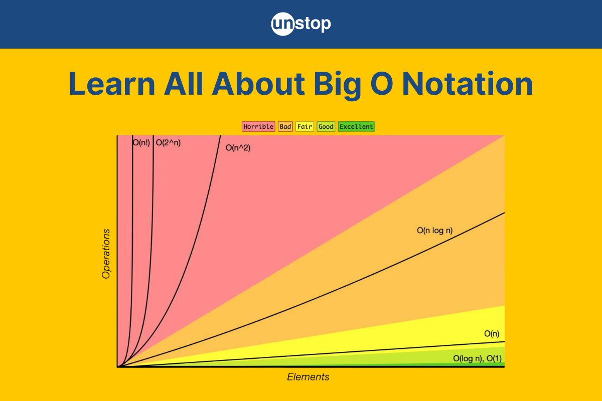

### Wonach suche ich?
Die geforderte Datenstruktur ist ein dynamischer, geordneter Container, der neben insert/delete/search auch predecessor/successor/min/max liefert
und dabei zusätzlich den In‑Order‑Index i des gefundenen Elements zurückgibt.

### Auswahl einer passenden Basisstruktur

Bei der Suche nach einer geeigneten Basis fuer meine Datenstruktur habe ich mir die verschiedenen Variationen von Baeumen angeschaut.
Dabei habe ich mich fuer einen **Rot-Schwarz-Baum** entschieden, da dieser eine gute Balance zwischen Einfuege-, Loesch- und Suchoperationen bietet.
Ein einfacher binaerer Baum kann im Durchschnitt schneller sein, faellt im Worst-Case-Szenario aber weit zurueck was die Performance und Komplexitaet angeht.
Alternativ haette ich auch einen **AVL-Baum** in Betracht ziehen koennen, aber mit Rot-Schwarz-Baeumen habe ich schon etwas Erfahrung gesammelt was verschiedene Implementierungen angeht, daher habe ich mich gegen den AVL-Baum entschieden.

Ein Rot-Schwarz-Baum grantiert uns eine Hoehe von O(log n), was bedeutet, dass alle Operationen wie Einfuegen, Loeschen und Suchen in logarithmischer Zeit durchgefuehrt werden koennen.
Angesicht der Anforderungen an die Datenstruktur scheint mit dieser Baum am besten geeignet.



### Operationen der Datenstruktur
- `insert(key, value)`: Fuegt ein weiteres Vorkommen von `key` mit zugehoerigem `value` ein; existiert `key` bereits, wird zunaechst nur `count` in diesem Knoten erhoeht, sonst wird ein neuer Knoten mit `count = 1` in den Baum eingefuegt. 

- `delete(key)`: Entfernt ein Vorkommen von `key`, falls vorhanden; bei `count > 1` wird lediglich `count` dekrementiert, bei `count = 1` wird der entsprechende Knoten wie in einem Rot‑Schwarz‑Baum geloescht und der Baum neu balanciert.

- `count(key) → ℕ`: Liefert die Anzahl des Schluessels `key` (0, falls `key` nicht enthalten ist).

- `size() → ℕ`: Liefert die Gesamtzahl aller Elemente im Baum, also die Summe aller `count`‑Werte ueber alle Knoten.

- `search(key) → bool`: Prueft, ob `key` mindestens einmal im Baum vorkommt (`count(key) > 0`).

- `isEmpty() → bool`: Prueft, ob `size() = 0` gilt.

- `min()/max() → <i, key>`: Liefert kleinstes/groesstes vorkommendes `key` samt In‑Order‑Index `i` ueber alle Elemente inklusive Duplikaten.

- `predecessor(z) → <i, key>`: Liefert das groesste Element mit `key <= z` sowie den Rang `i` des letzten Vorkommens dieses Schluessels in der In‑Order‑Reihenfolge.

- `successor(z) → <i, key>`: Liefert das kleinste Element mit `key >= z` sowie den Rang `i` des ersten Vorkommens dieses Schluessels in der In‑Order‑Reihenfolge.

### Struktur des Rot-Schwarz-Baums


Bei der Struktur meines Baumes reicht die gewoehnliche Definition eines Rot‑Schwarz‑Baums nicht aus, da ich zusaetzlich die Groesse der Teilbaeume und die Anzahl der gleichen Schluessel speichern muss,
 um das Einfuegen von Duplikaten und die Berechnung der In‑Order‑Raenge in O(log n) zu ermoeglichen.

Das Feld `key` dient dabei ausschliesslich zur Ordnung und zur Suche im Baum, waehrend im Feld `value` der zugehoerige Wert gespeichert wird.

Jeder Knoten speichert im Feld `size` die Anzahl der Elemente im von ihm entstehenden Teilbaum inklusive aller Duplikate;
das Feld `count` enthaelt die Multiplizitaet seines Schluessels in genau diesem Knoten.


```c
enum Color {
    Red,
    Black,
}

const RSTreeNode = struct {
    color: Color, // Rot oder Schwarz
    key: KeyType, // Schluessel zur Ordnung und Suche
    value: ValueType, // zugehoeriger Wert
    left: ?*RSTreeNode, // linker Kindknoten
    right: ?*RSTreeNode, // rechter Kindknoten
    parent: ?*RSTreeNode,// Elternknoten
    size: usize, // Anzahl der Elemente im Teilbaum inkl. Duplikaten
    count: usize, // Anzahl gleicher Schluessel in diesem Knoten
};
```

### Lautzeitanalyse und Speicherverbrauch

- isEmpty(): O(1)

`Wir pruefen nur ob die Root null ist. Boolean Operation.`

- search(key): O(log n)

`O(log n) da die Hoehe des Baumes log n ist und wir in jedem Schritt die Haelfte der Knoten ignorieren koennen.`

- insert/delete(key, value): O(log n)

`O(log n) da die Hoehe des Baumes log n ist und wir in jedem Schritt die Haelfte der Knoten ignorieren koennen. Das Einfuegen/Loeschen selbst ist eine konstante Operation.`

- min, max: O(log n)

`O(log n) Gleicher Grund wie bei search.`

- predecessor(key), successor(key): O(log n)

#### Speicherbedarf

Der Speicherbedarf der Datenstruktur ist O(n), wobei n die Gesamtanzahl der gespeicherten Elemente inklusive Duplikaten ist.

Fuer jeden unterschiedlichen Schluessel wird genau ein Knoten angelegt, der zusaetzlich zu `key` und `value` mehrere Attribute speichert:
drei Pointer (`left`, `right`, `parent`), die Farbe `color`, die Teilbaumgroesse `size` sowie den Zaehler `count` fuer Duplikate.

Diese zusaetzlichen Felder erhoehen den konstanten Bedarf des Speichers, aendern aber nicht dessen Ordnung O(n).

### Zig-Code (Pseudocode)

**Ich bin direkt mit Zig eingestiegen, weil ich mit tatsaechlichen kleinen Implementierungen besser Gedanken verfolgen kann. (Und um die Komplexitaet zu testen und zu validieren ob ich gerade Quatch schreibe.)**

Insert:
```c
function size(node):
    if node == null:
        return 0
    return node.size
```

```c
function insert(node, key, value):
    if node == null:
        // neuer Knoten mit einem Vorkommen
        return new Node(key, value, count = 1, size = 1)
    if key < node.key:
        node.left = insert(node.left, key, value)
        node.left.parent = node
    else if key > node.key:
        node.right = insert(node.right, key, value)
        node.right.parent = node
    else:
        // Duplikat: nur den Zaehler erhoehen
        node.count += 1

    // Teilbaumgroesse aus Kindern und count neu berechnen
    node.size = size(node.left) + size(node.right) + node.count

    // neue Balancierung
    return rebalance(node)

```

```c
function delete(root, key):
    node = search_node(root, key)
    if node == null:
        return root  // nichts zu loeschen

    if node.count > 1:
        // nur ein Vorkommen entfernen
        node.count -= 1

        // Groessen auf dem Pfad zur Wurzel aktualisieren
        current = node
        while current != null:
            current.size = size(current.left) + size(current.right) + current.count
            current = current.parent
        return root

    // count == 1: physischer Knoten wird entfernt
    root = delete_node_rb(root, node)
    return root
```

predecessor/successor: (Mit Hilfsfunktionen)
```c
function size(node):
    if node == null:
        return 0
    return node.size

function rank_last(node):
    // Rang des letzten Vorkommens von node.key
    i = size(node.left) + node.count
    current = node
    while current.parent != null:
        if current == current.parent.right:
            // kompletter linker Teilbaum + count des Elternknotens
            i += size(current.parent.left) + current.parent.count
        current = current.parent
    return i

function rank_first(node):
    // Rang des ersten Vorkommens von node.key
    i = size(node.left) + 1
    current = node
    while current.parent != null:
        if current == current.parent.right:
            i += size(current.parent.left) + current.parent.count
        current = current.parent
    return i

function predecessor(root, z):
    node = root; best = null
    while node != null:
        if node.key <= z:
            best = node
            node = node.right  // suche noch groessere <= z
        else:
            node = node.left
    if best == null:
        return (null, null)   // kein Vorgaenger
    // best.key <= z ist der gesuchte Wert
    i = rank_last(best)       // Rang des letzten Vorkommens
    return (i, best.key)

function successor(root, z):
    node = root; best = null
    while node != null:
        if node.key >= z:
            best = node
            node = node.left   // suche noch kleinere >= z
        else:
            node = node.right
    if best == null:
        return (null, null)
    // best.key >= z ist der gesuchte Wert
    i = rank_first(best)      // Rang des ersten Vorkommens
    return (i, best.key)

```

### Quellen / Hilfsquellen

- https://www.geeksforgeeks.org/dsa/time-complexities-of-different-data-structures/
- https://en.wikipedia.org/wiki/Predecessor_problem
- https://en.wikipedia.org/wiki/Self-balancing_binary_search_tree
- https://en.wikipedia.org/wiki/Van_Emde_Boas_tree
- https://ls2-web.cs.tu-dortmund.de/~mamicoja/dap2/slides/lec_redblack.pdf
- https://groups.csail.mit.edu/mac/projects/info/schemedocs/ref-manual/html/scheme_113.html
- https://dtu.ac.in/Web/Departments/CSE/faculty/lect/DSA_MK_Lect8.pdf
- https://www.baeldung.com/cs/skip-lists


Zum "ausprobieren":
- https://www.cs.usfca.edu/~galles/visualization/RedBlack.html